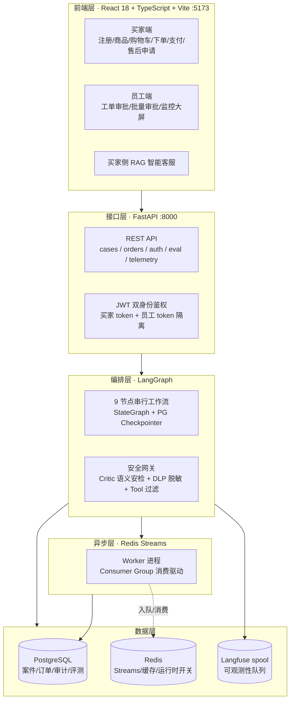
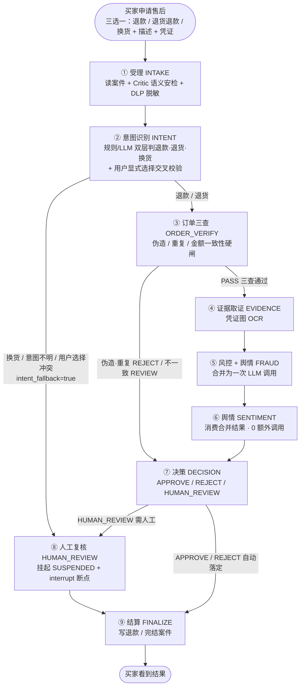

# 电商购买与 Agent 协同退款平台

> 多 Agent 协同的智能售后退赔决策系统 —— 从"人肉 + 硬规则"到"自动 + 安全 + 可审计"

一套**买家可真实下单、支付、申请售后**的电商演示平台。后端用 9 个 Agent 节点串行编排售后退赔全流程：受理 → 意图识别 → 订单三查 → 凭证 OCR → 风控 + 舆情 → 决策 → 人工复核 → 结算。

## 目录

- [核心特性](#核心特性)
- [系统架构](#系统架构)
- [工作流设计](#工作流设计)
- [技术栈](#技术栈)
- [项目结构](#项目结构)
- [快速开始](#快速开始)
- [评测体系](#评测体系)
- [安全设计](#安全设计)

---

## 核心特性

| 模块 | 说明 |
|---|---|
| **9 节点串行工作流** | 受理 → 意图 → 订单三查 → 凭证OCR → 风控+舆情 → 决策 → 人工复核 → 结算 |
| **双层意图识别** | 规则层零 LLM 优先，LLM 精判兜底；用户显式选择与文本交叉校验，冲突转人工 |
| **成本优化** | 风控 + 舆情合并为一次 LLM 调用，Token ↓40~50%、时延砍半 |
| **零信任安全网关** | Critic 语义安检前置，注入/越狱拦截 100%，BLOCK 即短路防烧钱 |
| **异步解耦** | Redis Streams 生产者-消费者，Worker 进程独立消费，支持多 Worker |
| **人工断点恢复** | interrupt 挂起 → 主管逐单/批量审批 → resume 从断点继续 |
| **完整评测闭环** | Golden 三维 5.0 / 红蓝对抗 133 样本 / 周期测试 110 样本 / RAG 20 条 |
| **全链路可审计** | 逐节点 PostgreSQL Checkpoint + AuditLog，图跑到哪都落库 |

---

## 系统架构



---

## 工作流设计

**一句话：9 个节点严格串行，一条流水线走到底；图里的"分叉"都是条件路由（二选一），运行时只挑一条走下去。**



### 三条真实路径

| 路径 | 走向 | 效果 |
|---|---|---|
| **A · 正常退款单** | ②退款 → ③PASS → ④OCR → ⑤风控 → ⑦APPROVE → ⑨结算 | 全自动，全程无人 |
| **B · 伪造/重复订单** | ③硬闸 REJECT → ⑦REJECT → ⑨结算 | 跳过 OCR 与风控 LLM，直接拒 |
| **C · 换货/意图冲突** | ②fallback → ⑧人工复核挂起 | 跳过决策与全部 LLM，等人工 |

---

## 技术栈

**后端**：Python 3.12 · FastAPI · SQLAlchemy 2.0 · Alembic · PostgreSQL · Redis · LangGraph · PaddleOCR · e2b 沙箱

**前端**：React 18 · TypeScript · Vite · React Router

**基础设施**：Docker · Redis Streams · Langfuse（可观测性）

---

## 项目结构

```
.
├── backend/
│   ├── app/
│   │   ├── api/              # REST 接口（案件/订单/买家/评测/安全报表）
│   │   ├── workflow/         # LangGraph 9 节点 + 路由 + 状态
│   │   ├── intent/           # 双层意图识别 + 交叉校验
│   │   ├── security/         # Critic 语义安检 / DLP / 红蓝对抗
│   │   ├── agents/           # OCR / 风控 Provider 注入
│   │   ├── eval/             # Golden 评测 / 周期测试 / RAG 评测
│   │   ├── rag/              # 买家侧智能客服（BM25 检索 + 编排）
│   │   ├── infrastructure/   # Redis Streams / Checkpointer / 事件
│   │   ├── worker/           # 异步消费进程
│   │   └── policy/           # 决策规则
│   ├── alembic/              # 数据库迁移
│   ├── scripts/              # 初始化 / 种子 / 评测脚本
│   └── tests/                # 30 个测试文件
├── frontend/                 # React 18 + TS + Vite
├── docs/                     # 需求文档 / 评测报告 / 知识库
├── products/                 # 商品数据（小米商城 392 商品 + 图片）
└── sample_evidence/          # 示例凭证图（OCR 演示用）
```

---

## 快速开始

### 环境要求

- Python 3.12、Node.js 18+
- PostgreSQL、Redis
- （可选）PaddleOCR 依赖，需用 `backend/.venv` 启动后端才走真 OCR，否则静默降级 FakeOcr

### 1. 初始化数据库与后端

```bash
cd backend
pip install -r requirements.txt

# 初始化表结构与种子数据（幂等）
python scripts/init_db.py
python scripts/seed.py
python scripts/seed_products.py

# 启动后端（端口 8000）
./.venv/Scripts/python.exe -m uvicorn app.main:app --host 0.0.0.0 --port 8000
```

### 2. 启动异步 Worker（独立进程，消费 Redis Streams）

```bash
# 另开一个终端
cd backend
./.venv/Scripts/python.exe -m app.worker.main
```

> ⚠️ **注意**：改后端代码后，`uvicorn` 与 `worker` 是**两个独立进程，都要重启**才生效。

### 3. 启动前端

```bash
cd frontend
npm install
npm run dev        # http://localhost:5173
```

### 4. 配置 `.env`

复制根目录 `.env`（JWT 密钥、数据库 DSN、Redis 地址、E2B 沙箱等）。`.env` 已在 `.gitignore` 中，**不会也不应提交到仓库**。

---

## 评测体系

| 评测 | 规模 | 关键结果 |
|---|---|---|
| **Golden 三维评测**（real 模式） | 10 用例 | 决策正确性 / 金额边界 / 理由质量 全 5.0 |
| **意图周期测试** | 110 样本 | 召回 100%（红线≥90%）、幻觉 0%（红线≤2%）、Token↓72.5% |
| **红蓝对抗压测** | 133 攻击样本 | 注入拦截 100%、越狱 100%、DLP 漏报 0% |
| **客服知识库 RAG 回归** | 20 条 | 五维指标全绿 |
| **单元/集成测试** | 30 文件 | 全绿 |

相关报告见 [`docs/`](docs/) 目录。

---

## 安全设计

- **Critic 语义安检前置**：任何描述在进入下游模型前先打风险分，≥0.85 即 BLOCK 短路转人工复核——脏数据不进任何模型，不白花 Token。
- **DLP 两处脱敏**：进 LLM 前 + 写日志前，手机号/身份证/API Key 等脱敏准确率 ≥99%。
- **Tool 过滤**：finalize 执行退款动作前拦截危险调用。
- **金额一律"分"整数**：禁浮点，资损敏感场景宁可慢不能错。
- **三层防重**：幂等键 + 分布式锁 + 状态校验，批量审批不重复退款。
- **双身份鉴权**：买家 JWT 与员工 JWT 完全隔离。
- **沙箱隔离**：批量审批 Excel 在沙箱内解析（e2b / SANDBOX_MODE）。

---

## 许可证

本项目为教学/演示用途。数据与密钥请勿用于生产环境。
