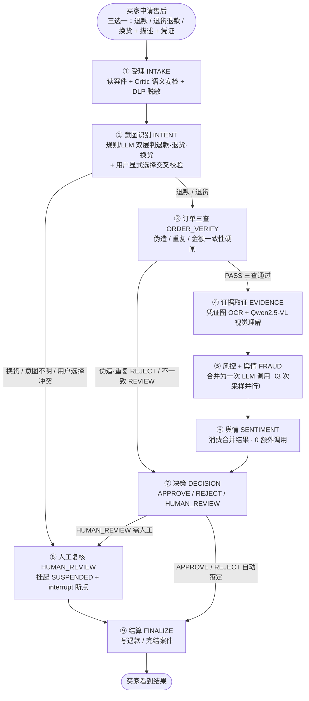

# 数字人直播 + 电商 Agent 协同退款平台

> 一套**电商场景**的 AI 应用集合：数字人主播实时带货直播 + 多 Agent 协同智能售后退赔决策

本仓库包含两个可独立运行、又共用同一套电商后端（商品 / 购物车 / 订单）的系统：

| 系统 | 一句话 | 入口 |
|---|---|---|
| **① 数字人直播**（主体） | 数字人主播 7×24 循环讲解商品 + 弹幕实时问答，观众可边看边下单 | `/live` 卖货直播页 |
| **② Agent 协同退款** | 9 个 Agent 节点串行编排售后退赔全流程，自动决策 + 安全审计 | 买家售后 / 员工工作台 |

---

## 目录

- [一、数字人直播系统](#一数字人直播系统)
  - [核心能力](#核心能力)
  - [技术架构](#技术架构)
  - [直播 SOP 与讲解调度](#直播-sop-与讲解调度)
  - [弹幕抢占机制](#弹幕抢占机制)
  - [部署与配置](#部署与配置)
- [二、Agent 协同退款平台](#二agent-协同退款平台)
- [三、项目结构](#三项目结构)
- [四、快速开始](#四快速开始)

---

# 一、数字人直播系统

> 数字人主播「小美」在直播间实时口播带货 —— 脸 + 脑 + 声 + 流 + 壳 五块拼装

## 核心能力

| 能力 | 说明 |
|---|---|
| **实时弹幕问答** | 观众弹幕 → LLM 生成带货话术 → 数字人开口回答，**抢占讲解**优先回应观众 |
| **自动循环讲解** | 7 段直播 SOP（开场→卖点→场景→差异化→价格→售后→促单），讲完一轮换说法重讲，永不冷场 |
| **多轮不重复** | LLM 按段改写同一环节的话术，第 N 轮自动换表述，解决"观众听出重复" |
| **拟人化节奏** | 段落间换气停顿带随机抖动（gap±jitter），避免节拍器式的机械感 |
| **流水线预生成** | 观众看当前段视频时，后台已想好下一段话术，消除"干等 LLM"的空档 |
| **降级不断流** | LLM / 渲染任一环节故障 → 兜底话术顶上，直播永不中断 |
| **合规标识** | 前端常驻「AI 数字人主播」标识 |

## 技术架构

```
┌─ 本地（RTX 5060 机器）──────────────────────────────┐
│  React LiveSellPage                                 │
│    · 视频播放区（<video> 直连渲染服务）              │
│    · 商品卡（复用电商商品/购物车 API）               │
│    · 弹幕区 + AI 标识                                │
│                                                      │
│  FastAPI /api/v1/live                                │
│    · 开播/停播/状态轮询（3s）                        │
│    · 弹幕中继、讲解暂停/继续                         │
│    · LiveSessionManager（单路直播会话状态机）        │
└──────────────────────┬───────────────────────────────┘
                       │ HTTP（可经 SSH 隧道）
┌──────────────────────┴───────────────────────────────┐
│  算力云 GPU 实例（AutoDL，按量计费）                  │
│    · 对话大脑：agicto 中转 deepseek-v4-flash          │
│    · TTS：CosyVoice2                                  │
│    · 口型引擎：MuseTalk                               │
│    · 输出 mp4 → /say 同步返回 video_url + duration    │
└───────────────────────────────────────────────────────┘
```

**关键技术选型**

| 环节 | 方案 | 说明 |
|---|---|---|
| **脑**（对话） | `deepseek-v4-flash` via agicto | 便宜 + 强，¥2/¥8 per M tokens |
| **声**（语音） | CosyVoice2 | 支持声音克隆 |
| **脸**（口型） | MuseTalk | 轻量，8G 显存可跑；备选 Ultralight-Digital-Human |
| **壳**（前端） | React 18 + TypeScript + Vite | 复用现有电商前端 |
| **流**（传输） | mp4 直链 | 简化方案：`/say` 同步返回已渲好的视频 |

> **与原腾讯 IVH 方案的差别**：只在"最后一跳"。IVH 是 `文本 → SEND_TEXT → 云端 TTS+渲染 → WebRTC 流`（秒级）；现在是 `文本 → 算力云 /say → CosyVoice2 + MuseTalk → mp4`（分钟级同步渲染，前端直接播 mp4）。

## 直播 SOP 与讲解调度

讲解内容由**固定骨架 + LLM 改写**双层控制（`app/live/script.py`）：

```
7 段固定 SOP（保证合规与节奏，不跑偏）
  开场 → 核心卖点 → 使用场景 → 差异化 → 价格 → 售后保障 → 促单
       ↓ 每段给 LLM 一个 brief 改写指令
  LLM 换说法（解决"第二轮重复"）→ 失败则用该段兜底模板
```

**调度循环**（`LiveSessionManager._touting_loop`）：

```
等观众看完当前视频 → 换气停顿(gap±jitter) → 取预生成话术 → 渲染下发 → 推进段落
                                    ↑
                        预生成：趁观众看视频时提前想好下一段
```

**节奏参数**（`.env` 可调）

| 参数 | 默认 | 说明 |
|---|---|---|
| `live_touting_gap_seconds` | 0.8 | 段落间换气停顿 |
| `live_touting_gap_jitter` | 0.3 | 停顿抖动幅度（实际停在 gap±jitter 随机） |
| `live_touting_use_llm` | true | false=只用脚本骨架兜底，不调 LLM |
| `live_touting_enabled` | true | 开播后是否自动循环讲解 |

**话术长度控制**：单段 ≤150 字（约 10~15 秒视频）。截断必须落在句末标点（`truncate_at_sentence`），否则数字人会"念到一半戛然而止"。

## 弹幕抢占机制

观众提问优先于自动讲解 —— 这是直播间体验的核心：

```
弹幕到达 → LLM 生成回答（文字立即回显，~1s）
        → _qa_active += 1（讲解循环挂起）
        → 渲染排队（GPU 串行，一次只能渲一条）
        → 数字人开口回答
        → 视频放完，_qa_active -= 1，自动续讲
```

- **渲染串行排队**：GPU 一次只能渲染一条，问答排在队首
- **讲解挂起**：`_qa_active > 0` 期间讲解循环让位，但**预生成的话术保留**（脚本未推进，内容依然有效）
- **文字先回显**：LLM 生成的是文本，立即返回前端显示，不必等 1~2 分钟的渲染

## 部署与配置

**环境要求**（关键：工单写的 CUDA 11.7 跑不了现代 GPU）

```bash
# 云实例（AutoDL 4090 24G，约 ¥2.5/小时，仅开播时段拉起）
conda create -n dh python=3.10 -y && conda activate dh
pip install torch==2.5.0 --index-url https://download.pytorch.org/whl/cu124
pip install edge-tts
# 需要 WebRTC 时再起 SRS
docker run -p 1935:1935 -p 1985:1985 -p 8080:8080 -p 8000:8000/udp ossrs/srs:5
```

> CUDA 12.4 + PyTorch 2.5+ 是硬要求：本地 5060 是 Blackwell 架构、云上 4090 是 Ada，都不兼容 CUDA 11.7。

**后端配置**（`.env`）

```bash
# 渲染服务（AutoDL 实例上的 FastAPI，本机经 SSH 隧道访问时填隧道地址）
DH_API_BASE_URL=http://127.0.0.1:8600
DH_API_TIMEOUT_SECONDS=300

# 对话大脑
LIVE_LLM_MODEL=deepseek-v4-flash
LIVE_LLM_TEMPERATURE=0.7
```

**成本**：4090 按量 ≈ ¥2.5/小时，直播 4h/天 ≈ ¥10/天（月 ≈ ¥300，仅直播时段开机）

---

# 二、Agent 协同退款平台

> 多 Agent 协同的智能售后退赔决策系统 —— 从"人肉 + 硬规则"到"自动 + 安全 + 可审计"

买家可真实下单、支付、申请售后。后端用 9 个 Agent 节点串行编排全流程：受理 → 意图识别 → 订单三查 → 凭证 OCR + 视觉理解 → 风控 + 舆情 → 决策 → 人工复核 → 结算。

## 核心特性

| 模块 | 说明 |
|---|---|
| **9 节点串行工作流** | 受理 → 意图 → 订单三查 → 凭证 OCR/VL → 风控+舆情 → 决策 → 人工复核 → 结算 |
| **双层意图识别** | 规则层零 LLM 优先，LLM 精判兜底；用户显式选择与文本交叉校验，冲突转人工 |
| **视觉凭证理解** | Qwen2.5-VL 理解凭证图片语义（不依赖图内文字），与用户描述做一致性比对 |
| **凭证一致性独立判定** | 规则层三维比对（破损声明/严重度/品类）+ LLM 兜底，从风控分拆出独立信号 |
| **成本优化** | 风控 + 舆情合并为一次 LLM 调用（Token ↓40~50%）；意图双层漏斗（Token ↓72.5%）；FRAUD 三次采样并行化 |
| **零信任安全网关** | Critic 语义安检前置，注入/越狱拦截 100%，BLOCK 即短路防烧钱 |
| **异步解耦** | Redis Streams 生产者-消费者，Worker 进程独立消费，支持多 Worker |
| **人工断点恢复** | interrupt 挂起 → 主管逐单/批量审批 → resume 从断点继续 |
| **完整评测闭环** | Golden 三维 5.0 / 红蓝对抗 133 样本 / 周期测试 110 样本 / RAG 20 条 |

## 工作流设计

**9 个节点严格串行，一条流水线走到底；图里的"分叉"都是条件路由（二选一）。**



## 性能与并发

| 指标 | 实测值（107 案件） |
|---|---|
| 用户感知延迟 | **毫秒级**（接口写库 + 入队即返回，异步处理） |
| 后台处理延迟 | P50 **3.3s** / 平均 **9.9s** / P95 30.5s |
| 瓶颈节点 | FRAUD（LLM 采样）、EVIDENCE（OCR + VL 冷启动） |
| 单 Worker 吞吐 | 约 6 单/分钟（串行）；多 Worker 近似线性扩展 |

**并发防线**：Redis Streams 削峰 → Consumer Group 分工 → PG 乐观锁防同案并发 → 幂等键 + 分布式锁防重复退款。失败兜底：重试流（上限 3）→ 死信队列 + 案件标 FAILED。

详见 [`docs/延迟与并发报告.md`](docs/延迟与并发报告.md)（复现：`python -m scripts.latency_report`）。

## 技术栈

**后端**：Python 3.12 · FastAPI · SQLAlchemy 2.0 · Alembic · PostgreSQL · Redis · LangGraph · PaddleOCR · Qwen2.5-VL · e2b 沙箱

**前端**：React 18 · TypeScript · Vite · React Router

**数字人**：CosyVoice2 · MuseTalk · deepseek-v4-flash (agicto) · AutoDL GPU

## 评测体系

| 评测 | 规模 | 关键结果 |
|---|---|---|
| **Golden 三维评测**（real 模式） | 10 用例 | 决策正确性 / 金额边界 / 理由质量 全 5.0 |
| **意图周期测试** | 110 样本 | 召回 100%（红线≥90%）、幻觉 0%（红线≤2%）、Token↓72.5% |
| **红蓝对抗压测** | 133 攻击样本 | 注入拦截 100%、越狱 100%、DLP 漏报 0% |
| **客服知识库 RAG 回归** | 20 条 | 五维指标全绿 |
| **单元/集成测试** | 277 用例 | 全绿 |

## 安全设计

- **Critic 语义安检前置**：任何描述进入下游模型前先打风险分，≥0.85 即 BLOCK 短路转人工——脏数据不进任何模型，不白花 Token。
- **DLP 两处脱敏**：进 LLM 前 + 写日志前，手机号/身份证/API Key 等脱敏准确率 ≥99%。
- **Tool 过滤**：finalize 执行退款动作前拦截危险调用。
- **金额一律"分"整数**：禁浮点，资损敏感场景宁可慢不能错。
- **三层防重**：幂等键 + 分布式锁 + 状态校验，批量审批不重复退款。
- **双身份鉴权**：买家 JWT 与员工 JWT 完全隔离。
- **沙箱隔离**：批量审批 Excel 在沙箱内解析（e2b / SANDBOX_MODE）。

---

# 三、项目结构

```
.
├── backend/
│   ├── app/
│   │   ├── live/             # ★ 数字人直播：会话管理/对话大脑/渲染出口/讲解脚本
│   │   ├── api/live.py       # ★ 直播接口（开播/停播/弹幕/讲解控制）
│   │   ├── api/              # REST 接口（案件/订单/买家/评测/安全报表）
│   │   ├── workflow/         # LangGraph 9 节点 + 路由 + 状态
│   │   ├── intent/           # 双层意图识别 + 交叉校验
│   │   ├── security/         # Critic 语义安检 / DLP / 红蓝对抗
│   │   ├── agents/           # OCR / VL 视觉理解 / 风控 Provider 注入
│   │   ├── policy/           # 决策规则 + 凭证一致性判定
│   │   ├── eval/             # Golden 评测 / 周期测试 / RAG 评测
│   │   ├── rag/              # 买家侧智能客服（BM25 检索 + 编排）
│   │   ├── infrastructure/   # Redis Streams / Checkpointer / 事件
│   │   ├── worker/           # 异步消费进程
│   │   └── policy/           # 决策规则
│   ├── alembic/              # 数据库迁移
│   ├── scripts/              # 初始化 / 种子 / 评测 / 延迟统计
│   └── tests/                # 277 个测试用例
├── frontend/                 # React 18 + TS + Vite
│   ├── src/pages/buyer/      # 买家端（含 LiveSellPage 卖货直播页）
│   └── src/pages/ops/        # 员工端（工单/审批/监控大屏）
├── docs/                     # 需求文档 / 评测报告 / 延迟报告
├── 数字人直播/                # ★ 数字人方案文档（架构规格 / 术语表 / 操作手册）
├── products/                 # 商品数据（小米商城 392 商品 + 图片）
└── sample_evidence/          # 示例凭证图（OCR 演示用）
```

---

# 四、快速开始

## 环境要求

- Python 3.12、Node.js 18+
- PostgreSQL、Redis
- （可选）PaddleOCR 依赖，需用 `backend/.venv` 启动后端才走真 OCR
- （可选）数字人直播：AutoDL GPU 实例 + Ollama（VL 视觉理解）

## 1. 初始化数据库与后端

```bash
cd backend
pip install -r requirements.txt

# 初始化表结构与种子数据（幂等）
python scripts/init_db.py
python scripts/seed.py
python scripts/seed_products.py

# 启动后端（端口 8000）
./.venv/Scripts/python.exe -m uvicorn app.main:app --host 0.0.0.0 --port 8000
```

## 2. 启动异步 Worker（独立进程，消费 Redis Streams）

```bash
cd backend
./.venv/Scripts/python.exe -m app.worker.main
```

> ⚠️ **注意**：改后端代码后，`uvicorn` 与 `worker` 是**两个独立进程，都要重启**才生效。

## 3. 启动前端

```bash
cd frontend
npm install
npm run dev        # http://localhost:5173
```

访问入口：
- 买家端 → `/live` **卖货直播** / 商品 / 购物车 / 售后
- 员工端 → 工作台 / 批量审批 / 监控大屏 / 评测页

## 4. 配置 `.env`

复制根目录 `.env`（JWT 密钥、数据库 DSN、Redis 地址、LLM API Key、数字人渲染服务地址等）。`.env` 已在 `.gitignore` 中，**不会也不应提交到仓库**。

数字人直播需额外配置 `DH_API_BASE_URL`（算力云渲染服务地址，见[部署与配置](#部署与配置)）。

---

## 许可证

本项目为教学/演示用途。数据与密钥请勿用于生产环境。
