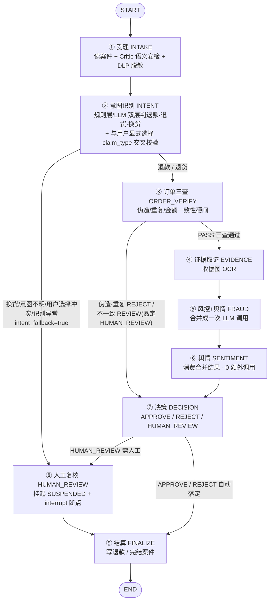
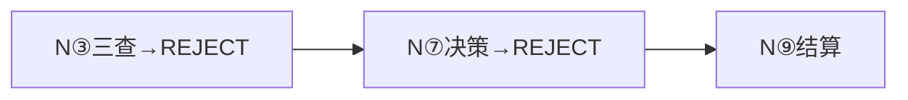
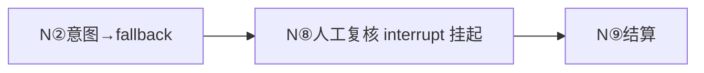

# 退款 Agent 工作流 · 9 节点流程图与执行模型

> 对应代码：`backend/app/workflow/graph.py`（编排）+ `backend/app/workflow/nodes.py`（9 个节点实现）
>
> **一句话结论：9 个节点完全串行，一条流水线走到底，不存在任何并行执行。**
> 图里的"分叉"都是**条件路由（二选一路径）**，不是并发——运行时只会挑其中一条走下去。

---

## 一、全链路流程图

**串行骨架**：`INTAKE → INTENT → ORDER_VERIFY → EVIDENCE → FRAUD → SENTIMENT → DECISION → FINALIZE`，外加一个插在 DECISION 与 FINALIZE 之间的人工断点 `HUMAN_REVIEW`。

---

## 二、九个节点的职责与依赖

| # | 节点 (record_agent_run 名) | 职责 | 读入（依赖上一个节点/库） | 写入供下游 |
|---|---|---|---|---|
| ① | INTAKE | 读案件、Critic 语义安检（防注入）、DLP 脱敏 | `refund_cases` | 脱敏 description、金额、`security_risk_score` |
| ② | INTENT | 双层意图识别（规则高置信先采信，否则 LLM）+ 与用户显式选择 `claim_type` 交叉校验：一致采信（source=declared）/文本不明采信声明/**冲突转人工**（资损零容忍） | description + claim_type | `intent`、`intent_fallback` |
| ③ | ORDER_VERIFY | 订单三查硬闸 | 订单号/金额/买家 | `order_verify_result`；命中 REJECT/REVIEW 时**预写 decision** |
| ④ | EVIDENCE | 收据图 OCR | `case_evidences` | `evidence_text`、`ocr_confidence` |
| ⑤ | FRAUD | 风控+舆情**合成一次 LLM 调用** | description + evidence_text | `fraud_score`、`sentiment_score`、`risk_level` |
| ⑥ | SENTIMENT | 直接消费 ⑤ 的合并结果（兜底默认值） | state（不重调模型） | `sentiment_score`、`risk_level` |
| ⑦ | DECISION | 阈值/规则决策 + 落库分数与 RiskAssessment | 全量风险输入 | `decision`、`review_reason` |
| ⑧ | HUMAN_REVIEW | 置 SUSPENDED + 建 ReviewTask + LeastActive 派单 + `interrupt()` 挂起 | state | 人工裁决回填（action/comment） |
| ⑨ | FINALIZE | 按决策写回订单退款/完结 | decision | 终态落库 |

---

## 三、运行时只有一条路径（这就是"串行"的体现）

全图有 3 个条件路由（`intent` → `order_verify`/`human_review`；`order_verify` → `evidence`/`decision`；`decision` → `human_review`/`finalize`），但**每次只走其中一条边**，没有两条边同时走。看三条真实路径：

**路径 A：正常退款单（走完 8 个节点）**

**路径 B：伪造/重复订单（跳过 OCR 与风控 LLM，直接拒）**

**路径 C：意图不明/换货（跳过决策与全部 LLM，直接挂起人工）**

三条路径都是**一串逐节点推进**，同一时刻永远只有一个节点在跑。

---

## 四、为什么是串行？（不是偷懒，是刻意设计）

1. **数据是前一个节点的输出**：EVIDENCE 的 OCR 文本 → FRAUD 拿它判分 → DECISION 拿分数下结论，天然是一条链，中间插不了并行。
2. **硬闸是为了"省钱且防误判"**：`order_verify` 一旦发现伪造/重复，**直接短路**跳过 OCR + 风控 LLM（`graph.py:67` 的 `_route_from_order_verify`）。脏数据不喂贵模型——这个"先验后验"的顺序本身就不允许并行。
3. **安全排序有讲究**：INTAKE 的 Critic 语义安检在**任何下游 LLM 之前**执行（工单6），防止注入文本劫持后续 Agent——顺序即安全。
4. **确定性强、好审计/好演示**：串行 + 逐节点 PostgreSQL checkpoint，任何一个节点都能断点恢复（这也是挂起/恢复能工作的前提）。

---

## 五、那"并行"在哪一层体现？

**平台没有做节点级并行，恰恰相反——它把两个节点"合并"了。** 见 ⑤ FRAUD 的注释（`nodes.py:522`，工单5 成本优化）：

> 风控+舆情合并为一次 LLM 调用，Token ↓40~50%、时延砍半；**sentiment_node 零额外调用，直接消费合并结果。**

也就是说 ⑤ 和 ⑥ 从"两个串行 LLM 调用"变成了"一次调用算两个指标"——**6 行里原来属于⑥的算力，被并进了⑤的一次调用里**。⑥退化成一个纯读 state 的壳（`nodes.py:545`：若确无结果则低风险兜底，绝不重复调用模型）。

**理论上可并行的点**：FRAUD 和 SENTIMENT 若分开，基于 EVIDENCE 输出两者互不依赖，本可以并行——但那样就是两次 LLM 调用的成本。平台用"合并调用"而不是"并行调用"来换时延与成本，对演示项目是更聪明的取舍。

---

## 六、串行执行的一个好处：可以逐节点存档

因为严格串行 + 配了 PostgreSQL Checkpointer，每跑完一个节点就写一条 checkpoint（`checkpoints` / `checkpoint_blobs`）。这意味着只要进度推进到某节点，连"图跑在哪、现状如何"都是落库状态，而不是内存里一笔糊涂账——这是前面聊的"挂起恢复"和"系统监控大屏"（`agent_runs` 按节点计时）能成立的地基。

---

*补充：agent_runs 表里记录的 INTAKE / EVIDENCE / FRAUD / SENTIMENT / DECISION 等 `agent_name`，对应上表 `record_agent_run` 的名字，是"This one ran"的审计轨迹，不是"这些同时跑过"。*